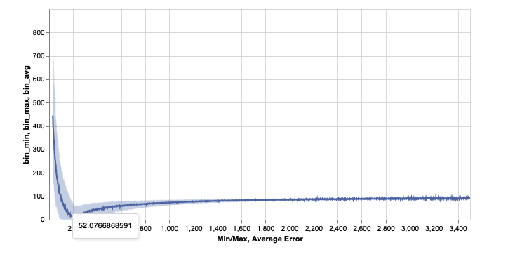

### This scatter(min,max) operations implementation deos not utilize any external libraries and is developed from scratch using numpy for carrying out expensive operations in numpy for performance
### Performance speedup followed by one time nd.array to tensor conversion to provide expected model input.
## This function allows real-time performance tracking during model training by monitoring relative errors w.r.t bin counts 
## Eg. For a bin [0-3500] MAE of 30 would not be as problematic as MAE of 30 for bin [0-40]  

## Installation
```bash
pip install 'git+https://github.com/saadnaeem-dev/torch-scatter'
```

## Args
- src: the actual values that are to be minimized or maximized
- index: the indices to be minimized or maximized
- device: provide the device on which src and index args reside
- reduce_op: type of reduce operation to perform options: min | max

## Outputs
- A tensor having min or max values grouped by index arg at the indices specified by position var (see fig)

## Example
```
>> from torch_scatter import scatter

>>> bin_max = scatter(
>>> src=torch.cat((error, bin_max)),
>>> index=torch.cat((ixs, range_tensor))
>>> device=self.bin_max.device,
>>> reduce_op='max'
>>> 
>>> self.bin_min = scatter(
>>> src=torch.cat((error, self.bin_min)),
>>> index=torch.cat((ixs, range_tensor.to(device=self.bin_min.device))),
>>> device=self.bin_min.device,
>>> reduce_op='min'
>>> )

```
- Implemented logic : 
.png "logicFlowDiagram")
- Performance tracking (shaded area represents max and min error bounds within each bin) : 


